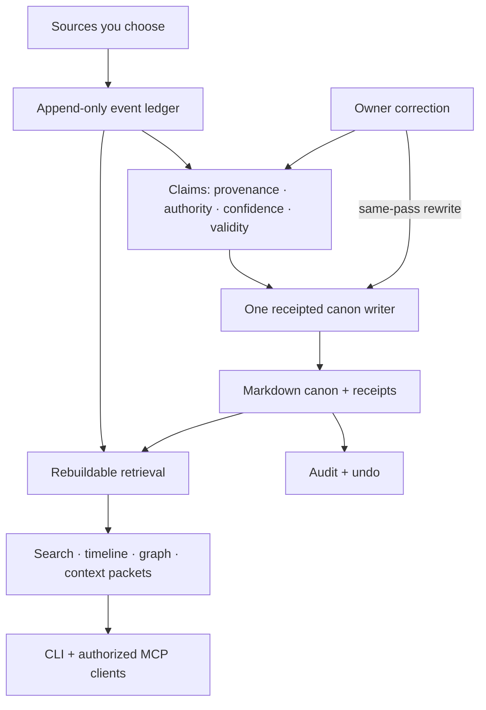

<div align="center">

# Kizuki

### The world model for your AI.

**Every AI starts from zero. Kizuki gives every authorized agent the same continuously updated model of you and your world.**

Local-first. Source-linked. Reversible. Harness-neutral.<br />
Your context should outlive the tool that learned it.

[Vision](#the-vision) · [Quick start](#quick-start) · [Architecture](#architecture) · [Agents](#bring-your-agents) · [Roadmap](#roadmap) · [Status](#status)

[](LICENSE)
[](#status)
[](https://bun.sh)

</div>

---

The decision is in an old chat. The reasoning is in a note. Someone promised something in Telegram. A project changed direction in a coding session. You learned a concept in one model, rejected an approach in another, and discovered what actually worked somewhere else.

Then you open a new agent and explain your world again.

**Kizuki exists to end that reset.**

## The vision

Models are increasingly interchangeable intelligence. Agent harnesses are increasingly interchangeable execution. What does not automatically move between them is **a durable, high-fidelity model of reality**: who you are, who is around you, what you know, what you are learning, what is happening, what matters, what has changed, what remains uncertain, and why any of it is believed.

Kizuki is building that layer.

The end state is not a searchable book of conversations. It is a **personal world model** that continuously converts the sources you choose into an evidence-backed representation of your world and your place inside it.

```text
source reality
    ↓
events and evidence
    ↓
observations
    ↓
atomic claims
    ↓
people · organisations · projects · concepts · ideas · frameworks
    ↓
relationships · state · perspective · trajectories
    ↓
knowledge · skills · curiosity · goals · situations · commitments
    ↓
procedures · outcomes · uncertainty · hypotheses
    ↓
world slices for authorized agents
    ↓
readable Markdown canon
```

Every higher-level understanding must retain a path back to evidence. A model inference is not silently promoted into fact. A correction can supersede what Kizuki believed. A purge remains computable. Canon remains readable on your disk.

### What a fresh agent should be able to understand

A new authorized agent should not need your autobiography. It should be able to ask Kizuki for the minimum sufficient world state for a task:

```text
Who is this person?
Who and what are around them?
What is happening now?
What matters to them?
What do they know?
What are they learning?
What are they good at?
What are they uncertain about?
What changed recently?
Which decisions and frameworks matter here?
What is blocked?
What evidence supports this?
What must not be assumed?
```

Kizuki should answer compactly, with provenance, freshness, uncertainty, sensitivity and authority intact.

### World Slices

The long-term signature primitive is a **World Slice**: a task-bounded compilation of the part of the owner's current world an authorized client needs.

A coding agent should receive different context from a meeting assistant. A design agent should receive relevant taste exemplars and prior decisions. A research agent should receive the owner's knowledge frontier and unresolved questions. A larger token budget must never grant broader permission.

### World revisions and diffs

World state changes. Kizuki's direction includes coherent world revisions and task-aware diffs so an agent can discover whether assumptions became stale without re-reading the entire vault.

Conceptually:

```text
WORLD DIFF
previous revision → current revision

people
  commitment added

projects
  status changed: active → blocked

knowledge
  concept state changed: encountered → applied

decisions
  prior choice superseded

questions
  one reopened after contradictory evidence
```

This is roadmap direction, not a claim that the current release already exposes a `world.diff` API.

### The owner is part of the world model

Kizuki should gradually build evidence-backed understanding of:

- concepts the owner has encountered, understood, connected, applied or demonstrated;
- questions and curiosities that survive individual conversations;
- knowledge gaps, misconceptions and stale understanding;
- skills demonstrated by outcomes rather than self-description alone;
- frameworks that were encountered, adopted, modified, rejected or superseded;
- preferences and taste scoped to the situations where they were observed;
- goals, constraints, commitments, decisions and active situations;
- procedures that repeatedly worked and failure modes that repeatedly did not;
- competing hypotheses and uncertainty without forcing premature certainty.

The goal is not to manufacture a personality profile. It is to preserve attributable, revisable state that helps future work start closer to where the owner actually is.

### Perspective matters

A real world model cannot flatten different viewpoints into one truth edge.

Kizuki's world-model direction distinguishes direct observation, Kizuki's current belief, the owner's stated belief, another person's stated belief, and an inference about what another person may believe. Inferred internal states must never masquerade as facts.

### Outcomes close the loop

The strongest long-term memory is not what somebody said. It is what happened.

```text
situation → decision → intended action → execution evidence → observed outcome → updated understanding
```

Execution remains outside Kizuki. External harnesses act. Kizuki supplies permitted world state and can record attributable evidence about what was attempted and what happened afterward.

That is how one successful task can improve the next agent's starting point without turning Kizuki into an unrestricted action harness.

## What runs today

Kizuki is already a local-first capture-to-context substrate. The current revision can bring selected sources into an append-only ledger, extract source-linked claims, search them, compile bounded context packets, write model-produced canon through one receipted autonomous writer, correct live claims, audit writes and undo them.

The richer world-model architecture above is the direction being built on top of those foundations. **No roadmap concept becomes a public feature until its implementation and acceptance proof exist.**

> **Pre-alpha · v0.1.0.** The local capture-to-context loop is runnable from a checkout. Autonomous canon writing requires a usable model bound by the running host. Capture, search, context, audit and undo remain useful without one. This is not a 1.0 release or a published installer.

## Quick start

Requires **Bun 1.3.14**, the version pinned by CI, and Git.

```bash
bun install --frozen-lockfile

demo="$(mktemp -d)"
mkdir "$demo/notes"
cat > "$demo/notes/atlas.md" <<'NOTE'
# Project Atlas
Mira leads Project Atlas.
We chose keyboard-first navigation for the accessibility prototype.
NOTE

cat > "$demo/policy.json" <<'POLICY'
{"purposes":["capture","recall","session","derive"],"allowed_fields":["text","subjects","attachments","metadata"],"retention":"persistent_owned_until_revoked","egress":"local_only","sensitivity_floor":"private"}
POLICY
chmod 600 "$demo/policy.json"

bun packages/cli/src/main.ts init "$demo/vault" --no-default --no-service
bun packages/cli/src/main.ts import markdown-folder --source "$demo/notes" --policy "$demo/policy.json" --expected-revision 0 --operation-id demo-import --vault "$demo/vault"
bun packages/cli/src/main.ts query "Atlas" --vault "$demo/vault"
bun packages/cli/src/main.ts context --purpose session --query "Atlas" --vault "$demo/vault"
bun packages/cli/src/main.ts doctor --vault "$demo/vault"
```

Importing does **not** itself write canon. Without a model, expect `canon writing: off`; the demo does not invent generated pages or model answers.

[Full CLI reference →](docs/cli.md)

## Connect sources

Start with `kizuki connect` to see the catalog and `kizuki connect status` to inspect enrolled sources and their last run. New enrollment requires an explicit [source consent policy](docs/cli.md#source-consent) before capture.

Current entry points include local Markdown, ChatGPT/Claude exports, WhatsApp/Pocket/Omnivore exports, Beeper Desktop, read-only IMAP, ICS files, offline Screenpipe ingestion, and one-shot [estate importers](docs/legacy-import.md) with owner-written mapping files. Provider-specific coverage and qualification limits are documented honestly rather than implied.

[Connection setup and limits →](docs/connect.md)

## Architecture

Kizuki deliberately separates **what happened**, **what it currently believes**, **what it writes for humans**, and **what it serves to clients**.



The world-model roadmap extends the middle of this pipeline. It does **not** replace the frozen ingress, claim authority, single writer, local custody, purge or permission model.

### Evidence remembers the source

Connectors emit the frozen `kizuki.event/v1` envelope. Source identity, occurrence time, observation time, subjects and content hashes travel into the owned ledger.

### Claims remember that understanding can change

Claims carry supporting event IDs, authority, confidence, sensitivity, validity and lifecycle state.

```text
owner_correction > owner_authored > connector_evidence > model_inference
```

A model's interpretation cannot outrank the owner's correction.

### Canon keeps ownership readable

Canon is ordinary Markdown on the owner's disk. Capture never writes pages directly. Every canon write goes through the receipted writer with provenance and before/after hashes so it can be audited and reversed.

### Derived intelligence stays rebuildable

Lexical search works without a model. Optional retrieval implementations sit behind versioned ports and own disposable stores. Future graph projections, semantic indexes, embeddings and Atlas views must remain rebuildable from authoritative state.

[Architecture →](docs/architecture.md) · [Autonomous canon →](rfcs/0002-autonomous-canon.md) · [Current direction →](docs/CURRENT.md)

## Bring your agents

Kizuki owns the memory and world state. Your chosen client owns its agent loop.

For an already-provisioned identity and grant:

```bash
bun packages/mcp/src/bin.ts --vault /absolute/path/to/vault --token-env KIZUKI_AGENT_TOKEN
```

The current stdio MCP adapter exposes:

| Read tools | Write tools |
| --- | --- |
| `search`, `get_page`, `query_entities`, `timeline`, `context_packet`, `graph_neighbors`, `system_health` | `propose`, `correct` |

`propose` files a claim. `correct` relays an authorized correction. There is no unrestricted `put_page` tool. Permission is enforced below the prompt layer through identity, grants, sensitivity ceilings, scopes, allowlists, rate limits and audit.

The roadmap adds world-model projections to this same authorization boundary rather than creating an agent-only backdoor.

## Product law: UX + DX + AX together

Every meaningful Kizuki capability should have **one canonical core implementation and one versioned semantic contract**.

Human, developer and agent surfaces are projections of that capability, not independent implementations.

- **UX:** useful answer first, with provenance, uncertainty, receipts and correction through progressive disclosure.
- **DX:** typed contracts, validators, migrations, deterministic errors, fixtures and conformance tests.
- **AX:** compact structured state with stable IDs, evidence refs, freshness, uncertainty and machine-readable failures instead of prose scraping.

A capability is not finished if one surface is excellent and the other two are afterthoughts.

## Roadmap

The world-model implementation program is tracked in GitHub:

- **#480** Living Epistemic World Model architecture
- **#476** Situation Intelligence + UX/DX/AX product law
- **#497** execution epic
- **#481–#496** bounded implementation packets

The build order is deliberately staged:

1. bind the world-model RFC without weakening RFC 0002;
2. add observations and semantic primitives;
3. add provenance dependency tracking, world revisions and invalidation;
4. prove an end-to-end Concept slice;
5. add questions, curiosity, knowledge gaps and personal epistemic state;
6. add perspective-aware people and relationship state;
7. add demonstrated skills, frameworks and procedures;
8. add dynamic situations, goals, commitments, decisions and dependencies;
9. compile task-aware World Slices;
10. add World Diffs and agent freshness;
11. add goal-aware attention and outcome learning;
12. only then add bounded hypotheses, forecasts and counterfactual world states;
13. expose the same semantics through the Knowledge Atlas human experience;
14. finish with a cross-cutting UX/DX/AX, privacy, purge and performance gauntlet.

Each slice must preserve provenance, temporal correctness, purge, sensitivity, correction and reversibility.

## Your data, your boundaries

**Local custody.** Authoritative state lives under the owner's vault; canon is ordinary Markdown.

**Zero phone-home.** Runtime network access is limited to explicitly configured connectors and model endpoints. There is no required hosted Kizuki memory service or telemetry.

**Fail closed.** Missing identity, grants, sensitivity or required provenance do not become permission. Captured text is data, never instruction.

**Readable exit.** Export, restore, audit, undo and purge are first-class ownership mechanisms.

**Honest threat model.** The current vault and canon are not encrypted by Kizuki. Someone who can read the host files can read the data. [Security model →](SECURITY.md)

## Status

**Pre-alpha, version 0.1.0.** The distinction between working capability and the complete world-model product matters.

| Layer | What this revision supports |
| --- | --- |
| Capture | Local sources, exports and selected connector paths. |
| Recall | Model-free lexical search, context packets and MCP read tools. Advanced retrieval depends on configured ports and data. |
| Claims | Source-linked working claims with authority, confidence, validity, sensitivity and supersession. |
| Canon | Model-configured autonomous writer; correction, receipts, audit and undo. |
| Operations | Local serve loop, doctor reporting and rebuildable retrieval. |
| Packaging | Source execution and locally built Linux x64 package. No published or signed installer. |
| World model | **Roadmap in progress.** Observation, semantic-state, perspective, learning-state, Situation, World Slice, World Diff, dynamics and Atlas layers described above are not all shipped public surfaces yet. |

## What Kizuki is not

Kizuki is not another chat UI, CRM, task manager, note-taking app or general-purpose agent harness.

Those systems can become sensors, consumers and actuators around the world model.

Kizuki owns the durable layer beneath them:

> **the continuously improving, evidence-backed model of the human's world.**

## Build on Kizuki

The architecture is a modular monolith with versioned ports. Connectors, models, embedding, retrieval and other replaceable components have explicit boundaries. Authoritative storage remains local and owned.

To add a source, implement `kizuki.connector/v1`, emit `kizuki.event/v1`, and pass the shared conformance suite. Unsupported provider behavior must be declared rather than imitated.

From a full-history checkout:

```bash
bun run verify
```

[Contributing](CONTRIBUTING.md) · [Agent instructions](AGENTS.md) · [Architecture](docs/architecture.md) · [Binding decisions](docs/decision-log.md)

## Retrieval credit

The hybrid retrieval recipe and entity-graph walk are a permitted fork of
[GBrain](https://github.com/garrytan/gbrain) at public commit
`8c70f6255047a7647adb30b1d6333a48068d9fa5`, vendored under
`packages/retrieval-pg/vendor/`. It is not a registry dependency. Rerank and
local GGUF remain Kizuki's own work.
[Upstream policy and attribution →](docs/upstream-policy.md)

## License

[MIT](LICENSE). **Free local forever. Recall is never metered.**

---

<div align="center">

**Your AI should not forget the world it is entering.**

</div>
